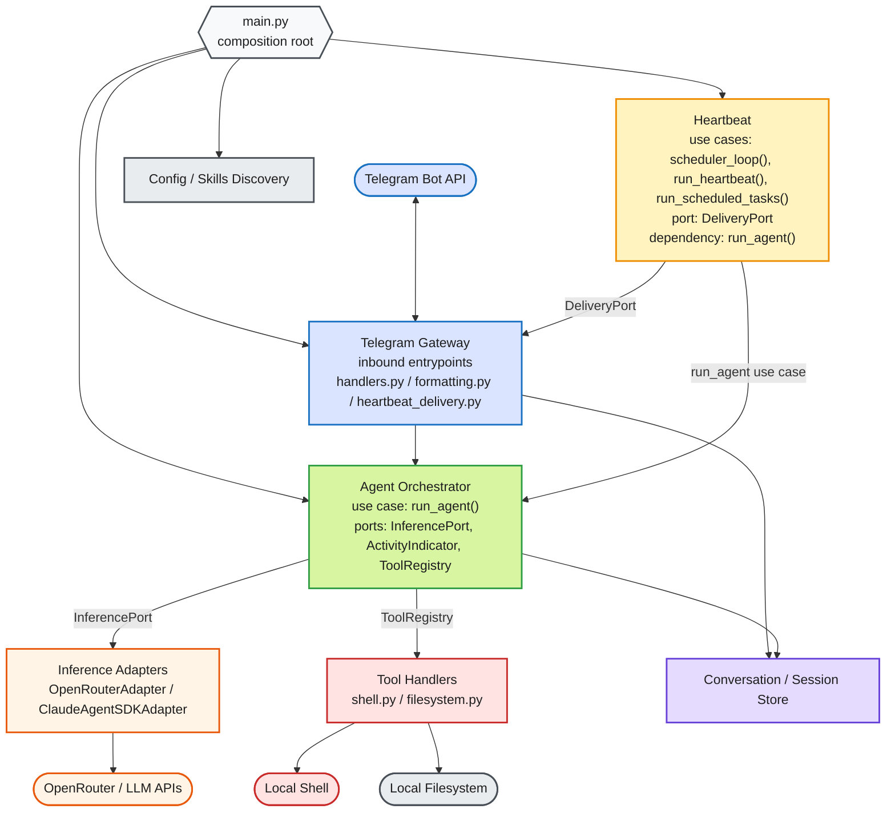

# Hexagonal Architecture View

This is the text-editable ports-and-adapters view of Talon.

## Shape Meanings

- Blue: Telegram boundary
- Green: agent orchestrator
- Amber: heartbeat
- Orange: inference / OpenRouter
- Red: shell tools
- Purple: conversation state
- Gray: config, filesystem, and composition root
- Arrow labels: ports or use-case boundaries
